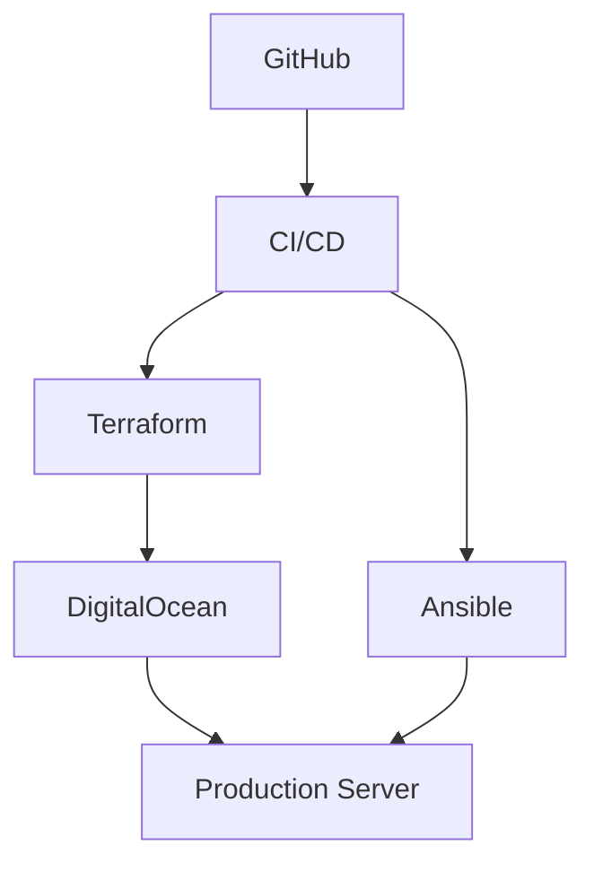

# Monorepo Improvement Recommendations

This document outlines potential improvements for the PAUSATF monorepo to enhance
developer experience, automation, security, and maintainability.

## Quick Wins (Easy & High Impact)

### 1. Add Makefile for Common Tasks

Create a root-level `Makefile` to standardize common operations:

```makefile
.PHONY: help setup test lint format clean

help:
	@echo "PAUSATF Monorepo Commands:"
	@echo "  make setup     - Install all dependencies and pre-commit hooks"
	@echo "  make test      - Run all tests"
	@echo "  make lint      - Run all linters"
	@echo "  make format    - Format all code"
	@echo "  make clean     - Clean build artifacts"
	@echo "  make tf-plan   - Run Terraform plan for all environments"
	@echo "  make ansible-check - Run Ansible syntax checks"

setup:
	@echo "Installing pre-commit hooks..."
	pre-commit install
	@echo "Installing Terraform dependencies..."
	cd terraform && terraform init -backend=false
	@echo "Setup complete!"

test:
	@echo "Running Terraform tests..."
	cd terraform && terraform fmt -check -recursive
	@echo "Running Ansible tests..."
	cd ansible && ansible-lint
	@echo "Running shell tests..."
	shellcheck scripts/**/*.sh

lint:
	pre-commit run --all-files

format:
	terraform fmt -recursive terraform/
	@echo "Code formatted!"

clean:
	find . -type d -name ".terraform" -exec rm -rf {} +
	find . -type f -name "*.tfstate*" -delete
	@echo "Cleaned build artifacts"
```

**Impact**: Simplifies common tasks, reduces onboarding time, ensures consistency.

### 2. Add CODEOWNERS File

Create `.github/CODEOWNERS` to automatically assign reviewers:

```text
# Global owner
* @thomasvincent

# Component-specific owners
/terraform/ @thomasvincent
/ansible/ @thomasvincent
/scripts/ @thomasvincent
/docs/ @thomasvincent
/themes/ @thomasvincent

# Workflows require extra review
/.github/workflows/ @thomasvincent

# Security-sensitive files
/.pre-commit-config.yaml @thomasvincent
/terraform/environments/production/ @thomasvincent
```

**Impact**: Automated PR assignments, clear ownership, better security.

### 3. Dependabot Configuration

Add `.github/dependabot.yml` for automated dependency updates:

```yaml
version: 2
updates:
  # Terraform providers
  - package-ecosystem: "terraform"
    directory: "/terraform"
    schedule:
      interval: "weekly"
    labels:
      - "dependencies"
      - "terraform"
    reviewers:
      - "thomasvincent"

  # GitHub Actions
  - package-ecosystem: "github-actions"
    directory: "/"
    schedule:
      interval: "weekly"
    labels:
      - "dependencies"
      - "github-actions"
```

**Impact**: Automated security updates, reduced maintenance burden.

### 4. Add Component README Templates

Ensure each component has a comprehensive README:

```markdown
# Component Name

## Overview
Brief description of what this component does.

## Directory Structure
```
component/
├── main files...
└── README.md
```

## Getting Started
How to work with this component.

## Testing
How to test changes locally.

## Deployment
How this component is deployed.

## Common Tasks
List of common operations.

## Troubleshooting
Common issues and solutions.
```

**Impact**: Better documentation, faster onboarding, fewer questions.

---

## Developer Experience Improvements

### 5. Add VS Code Workspace Configuration

Create `.vscode/settings.json` and `pausatf.code-workspace`:

```json
{
  "folders": [
    {
      "name": "🏠 Root",
      "path": "."
    },
    {
      "name": "🏗️ Terraform",
      "path": "terraform"
    },
    {
      "name": "⚙️ Ansible",
      "path": "ansible"
    },
    {
      "name": "📜 Scripts",
      "path": "scripts"
    },
    {
      "name": "📚 Docs",
      "path": "docs"
    },
    {
      "name": "🎨 Themes",
      "path": "themes"
    }
  ],
  "settings": {
    "files.exclude": {
      "**/.git": true,
      "**/.terraform": true,
      "**/node_modules": true
    },
    "search.exclude": {
      "**/.git": true,
      "**/.terraform": true,
      "**/node_modules": true,
      "**/content": true
    },
    "[terraform]": {
      "editor.formatOnSave": true
    },
    "[yaml]": {
      "editor.formatOnSave": true
    },
    "[markdown]": {
      "editor.formatOnSave": true,
      "editor.wordWrap": "on"
    }
  },
  "extensions": {
    "recommendations": [
      "hashicorp.terraform",
      "redhat.ansible",
      "timonwong.shellcheck",
      "davidanson.vscode-markdownlint",
      "esbenp.prettier-vscode"
    ]
  }
}
```

**Impact**: Consistent editor configuration, better developer experience.

### 6. Add Development Container

Create `.devcontainer/devcontainer.json` for containerized development:

```json
{
  "name": "PAUSATF Development",
  "image": "mcr.microsoft.com/devcontainers/base:ubuntu",
  "features": {
    "ghcr.io/devcontainers/features/terraform:1": {},
    "ghcr.io/devcontainers/features/python:1": {},
    "ghcr.io/devcontainers/features/node:1": {},
    "ghcr.io/devcontainers/features/docker-in-docker:2": {}
  },
  "postCreateCommand": "make setup",
  "customizations": {
    "vscode": {
      "extensions": [
        "hashicorp.terraform",
        "redhat.ansible",
        "timonwong.shellcheck"
      ]
    }
  }
}
```

**Impact**: Consistent development environment, easier onboarding.

### 7. Add EditorConfig

Create `.editorconfig` for consistent formatting:

```ini
root = true

[*]
charset = utf-8
end_of_line = lf
insert_final_newline = true
trim_trailing_whitespace = true

[*.{tf,tfvars}]
indent_style = space
indent_size = 2

[*.{yml,yaml}]
indent_style = space
indent_size = 2

[*.sh]
indent_style = space
indent_size = 2

[*.md]
trim_trailing_whitespace = false
max_line_length = 120

[Makefile]
indent_style = tab
```

**Impact**: Consistent formatting across editors and team members.

---

## CI/CD Improvements

### 8. Add PR Template

Create `.github/pull_request_template.md`:

```markdown
## Description
<!-- Describe your changes -->

## Type of Change
- [ ] Bug fix
- [ ] New feature
- [ ] Documentation update
- [ ] Infrastructure change
- [ ] Configuration change

## Components Affected
- [ ] Terraform
- [ ] Ansible
- [ ] Scripts
- [ ] Documentation
- [ ] Themes
- [ ] CI/CD

## Testing
<!-- Describe how you tested these changes -->

- [ ] Tested locally
- [ ] Terraform plan reviewed
- [ ] Ansible check mode passed
- [ ] Pre-commit hooks pass

## Checklist
- [ ] Code follows project conventions
- [ ] Documentation updated
- [ ] No secrets in code
- [ ] Backward compatible or breaking changes documented

## Screenshots
<!-- If applicable, add screenshots -->

## Related Issues
<!-- Link any related issues: Fixes #123 -->
```

**Impact**: Better PR quality, standardized reviews, fewer oversights.

### 9. Add Issue Templates

Create `.github/ISSUE_TEMPLATE/bug_report.md`:

```markdown
---
name: Bug Report
about: Report a bug or issue
title: '[BUG] '
labels: bug
assignees: thomasvincent
---

## Bug Description
<!-- Clear description of the bug -->

## Component
<!-- Which component is affected? -->
- [ ] Terraform
- [ ] Ansible
- [ ] Scripts
- [ ] Documentation
- [ ] Themes

## Steps to Reproduce
1.
2.
3.

## Expected Behavior
<!-- What should happen? -->

## Actual Behavior
<!-- What actually happens? -->

## Environment
- OS:
- Version:
- Additional context:

## Logs
<!-- Paste relevant logs -->
```

**Impact**: Better bug reports, faster issue resolution, organized tracking.

### 10. Optimize CI/CD with Caching

Update workflows to use caching:

```yaml
# Example for Terraform workflow
- name: Cache Terraform plugins
  uses: actions/cache@v4
  with:
    path: ~/.terraform.d/plugin-cache
    key: ${{ runner.os }}-terraform-${{ hashFiles('**/*.tf') }}
    restore-keys: |
      ${{ runner.os }}-terraform-

- name: Cache pre-commit
  uses: actions/cache@v4
  with:
    path: ~/.cache/pre-commit
    key: ${{ runner.os }}-pre-commit-${{ hashFiles('.pre-commit-config.yaml') }}
```

**Impact**: Faster CI/CD runs, reduced costs, better developer experience.

### 11. Add Workflow Status Badges

Update `README.md` to show CI/CD status:

```markdown
# PAUSATF Infrastructure Monorepo


```

**Impact**: Immediate visibility into build status, professional appearance.

---

## Security & Compliance

### 12. Add Security Policy

Create `SECURITY.md`:

```markdown
# Security Policy

## Supported Versions

| Component | Version | Supported          |
| --------- | ------- | ------------------ |
| Terraform | ~1.6    | :white_check_mark: |
| Ansible   | Latest  | :white_check_mark: |

## Reporting a Vulnerability

**DO NOT** create public GitHub issues for security vulnerabilities.

Instead:
1. Email security concerns to: thomasvincent@example.com
2. Include detailed information about the vulnerability
3. Allow up to 48 hours for initial response
4. Work with maintainers on coordinated disclosure

## Security Best Practices

- Never commit secrets or credentials
- Use ansible-vault for sensitive data
- Use Terraform variables for secrets
- Enable MFA on all accounts
- Keep dependencies updated
```

**Impact**: Clear security guidelines, responsible disclosure process.

### 13. Add Secret Scanning Workflow

Create `.github/workflows/security-scan.yml`:

```yaml
name: Security Scan

on:
  push:
    branches: [main]
  pull_request:
  schedule:
    - cron: '0 0 * * 0'  # Weekly

jobs:
  secret-scan:
    name: Secret Scanning
    runs-on: ubuntu-latest
    steps:
      - uses: actions/checkout@v6
        with:
          fetch-depth: 0

      - name: Run Gitleaks
        uses: gitleaks/gitleaks-action@v2
        env:
          GITHUB_TOKEN: ${{ secrets.GITHUB_TOKEN }}

  dependency-scan:
    name: Dependency Scanning
    runs-on: ubuntu-latest
    steps:
      - uses: actions/checkout@v6

      - name: Run Trivy
        uses: aquasecurity/trivy-action@master
        with:
          scan-type: 'config'
          scan-ref: '.'
```

**Impact**: Automated security scanning, early vulnerability detection.

### 14. Add License File

Create `LICENSE`:

```text
MIT License

Copyright (c) 2025 PAUSATF

[Full license text...]
```

**Impact**: Clear licensing, legal protection, open source compliance.

---

## Automation & Tooling

### 15. Add Automated Changelog Generation

Create `.github/workflows/changelog.yml`:

```yaml
name: Generate Changelog

on:
  push:
    tags:
      - 'v*'

jobs:
  changelog:
    runs-on: ubuntu-latest
    steps:
      - uses: actions/checkout@v6
        with:
          fetch-depth: 0

      - name: Generate Changelog
        uses: orhun/git-cliff-action@v3
        with:
          config: cliff.toml
          args: --latest --strip header
```

**Impact**: Automated release notes, better version tracking.

### 16. Add Commit Message Linting

Update `.github/workflows/commit-lint.yml`:

```yaml
name: Commit Lint

on:
  pull_request:
    types: [opened, edited, synchronize]

jobs:
  commitlint:
    runs-on: ubuntu-latest
    steps:
      - uses: actions/checkout@v6
        with:
          fetch-depth: 0

      - uses: wagoid/commitlint-github-action@v5
```

Create `commitlint.config.js`:

```javascript
module.exports = {
  extends: ['@commitlint/config-conventional'],
  rules: {
    'scope-enum': [
      2,
      'always',
      ['terraform', 'ansible', 'scripts', 'docs', 'themes', 'ci', 'deps']
    ]
  }
};
```

**Impact**: Consistent commit messages, better git history, automated changelogs.

---

## Documentation Improvements

### 17. Add Architecture Diagrams

Create `docs/architecture/` with diagrams:

```text
docs/architecture/
├── infrastructure.md       # Infrastructure overview
├── deployment-flow.md      # Deployment process
├── network-diagram.md      # Network topology
└── components.md           # Component relationships
```

Use tools like Mermaid for diagrams:



**Impact**: Better understanding of system, easier onboarding, clear documentation.

### 18. Add Runbooks

Create `docs/runbooks/` for common operations:

```text
docs/runbooks/
├── emergency-rollback.md
├── deploy-to-production.md
├── backup-restore.md
├── add-new-droplet.md
└── update-dns.md
```

**Impact**: Faster incident response, knowledge sharing, reduced downtime.

### 19. Add Decision Records (ADRs)

Create `docs/decisions/` for architectural decisions:

```markdown
# ADR-001: Monorepo Structure

## Status
Accepted

## Context
Need to manage multiple infrastructure components efficiently.

## Decision
Consolidate all repositories into a single monorepo.

## Consequences
Positive: Easier code sharing, unified CI/CD, atomic changes
Negative: Larger repository size, need for path-based workflows
```

**Impact**: Historical context, better decision-making, team alignment.

---

## Testing & Quality

### 20. Add Integration Tests

Create `tests/` directory structure:

```text
tests/
├── terraform/
│   ├── integration/
│   └── unit/
├── ansible/
│   └── molecule/
└── scripts/
    └── bats/
```

Example Terraform test with Terratest:

```go
// tests/terraform/integration/basic_test.go
package test

import (
    "testing"
    "github.com/gruntwork-io/terratest/modules/terraform"
)

func TestTerraformBasic(t *testing.T) {
    terraformOptions := &terraform.Options{
        TerraformDir: "../../terraform/environments/staging",
    }

    defer terraform.Destroy(t, terraformOptions)
    terraform.InitAndPlan(t, terraformOptions)
}
```

**Impact**: Higher quality code, catch bugs early, confidence in changes.

### 21. Add Performance Monitoring

Create `.github/workflows/performance.yml`:

```yaml
name: Performance Monitoring

on:
  pull_request:
  push:
    branches: [main]

jobs:
  terraform-performance:
    runs-on: ubuntu-latest
    steps:
      - uses: actions/checkout@v6

      - name: Benchmark Terraform Plan
        run: |
          time terraform plan -out=plan.tfplan
          terraform show -json plan.tfplan | jq '.resource_changes | length'
```

**Impact**: Track performance trends, optimize slow operations.

---

## Repository Organization

### 22. Add Shared Libraries

Create `lib/` directory for shared code:

```text
lib/
├── terraform/
│   └── modules/        # Reusable Terraform modules
├── ansible/
│   └── plugins/        # Custom Ansible plugins
└── scripts/
    └── common.sh       # Shared shell functions
```

**Impact**: Code reuse, consistency, reduced duplication.

### 23. Add Examples Directory

Create `examples/` for usage examples:

```text
examples/
├── terraform/
│   ├── simple-droplet/
│   └── full-stack/
├── ansible/
│   └── wordpress-deploy/
└── README.md
```

**Impact**: Easier learning, quick starts, better documentation.

---

## Monitoring & Observability

### 24. Add Health Checks

Create monitoring scripts in `scripts/monitoring/`:

```bash
#!/bin/bash
# scripts/monitoring/health-check.sh

check_website() {
    if curl -sf https://pausatf.org > /dev/null; then
        echo "✓ Website is up"
    else
        echo "✗ Website is down"
        return 1
    fi
}

check_ssl() {
    expiry=$(echo | openssl s_client -servername pausatf.org \
        -connect pausatf.org:443 2>/dev/null | \
        openssl x509 -noout -dates | grep notAfter)
    echo "✓ SSL: $expiry"
}

check_website
check_ssl
```

**Impact**: Proactive monitoring, faster incident detection.

### 25. Add Metrics Dashboard

Create `docs/metrics.md` linking to dashboards:

```markdown
# Infrastructure Metrics

## GitHub Insights
- [Repository Activity](https://github.com/pausatf/pausatf/pulse)
- [Code Frequency](https://github.com/pausatf/pausatf/graphs/code-frequency)
- [Contributors](https://github.com/pausatf/pausatf/graphs/contributors)

## CI/CD Metrics
- Average build time: Track in workflows
- Success rate: Monitor badge status
- Deployment frequency: Track via tags

## Infrastructure Health
- Uptime: [DigitalOcean Monitoring]
- Performance: [Cloudflare Analytics]
```

**Impact**: Data-driven decisions, performance tracking, accountability.

---

## Implementation Priority

### Phase 1: Quick Wins (Week 1)
1. Add Makefile
2. Add CODEOWNERS
3. Add Dependabot
4. Add workflow badges
5. Add PR/Issue templates

### Phase 2: Developer Experience (Week 2-3)
6. Add VS Code workspace
7. Add EditorConfig
8. Component READMEs
9. Add examples

### Phase 3: Security & Quality (Week 3-4)
10. Add security policy
11. Add secret scanning workflow
12. Add commit linting
13. Add tests

### Phase 4: Advanced (Ongoing)
14. Add architecture docs
15. Add runbooks
16. Add monitoring
17. Add performance tracking

---

## Measuring Success

Track these metrics to measure improvement effectiveness:

- **Onboarding Time**: Time for new contributor to make first PR
- **Build Time**: CI/CD pipeline execution duration
- **PR Review Time**: Time from PR creation to merge
- **Incident Response**: Time to detect and resolve issues
- **Code Quality**: Pre-commit hook pass rate, test coverage
- **Developer Satisfaction**: Survey team regularly

---

## Getting Help

For questions about implementing these improvements:
- Open a GitHub Discussion
- Contact @thomasvincent
- Reference this document in issues/PRs
