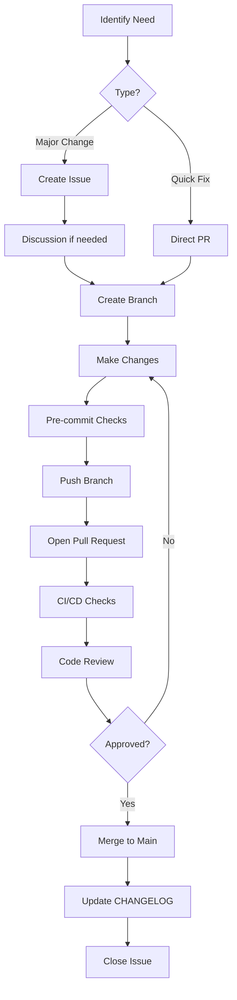

# GitHub Workflow Strategy for PAUSATF Infrastructure

**Created:** December 21, 2025
**Status:** Proposal
**Purpose:** Define optimal documentation organization and GitHub workflow adoption

## Executive Summary

This document proposes a GitHub-native workflow strategy for PAUSATF infrastructure documentation and operations. The strategy leverages GitHub's built-in collaboration tools while maintaining technical rigor through version control and automation.

**Recommendation:** Keep all technical documentation in version control, enable GitHub Discussions and Wiki for community/quick-reference content, and fully embrace GitHub's project management and automation features.

---

## Current State Analysis

### Documentation Inventory

**26 Technical Documents (Version Controlled):**
- 14 numbered guides/reports (01-14)
- 12 supporting documents (README, CHANGELOG, CONTRIBUTING, etc.)
- Total: 29 markdown files across repository

**GitHub Features Status:**
- ✅ **Issues:** Enabled
- ✅ **Projects:** Enabled
- ✅ **Actions:** Enabled (CI/CD workflows active)
- ❌ **Wiki:** Disabled
- ❌ **Discussions:** Disabled

**Repositories in Ecosystem:**
- pausatf-infrastructure-docs (documentation)
- pausatf-terraform (infrastructure provisioning)
- pausatf-ansible (configuration management)
- pausatf-scripts (automation scripts)

### Strengths of Current Approach

1. **Version Control for Everything**
   - All changes tracked
   - Full audit trail
   - Easy rollback
   - Branch protection with GPG signing

2. **Automated Quality Control**
   - Markdown linting
   - Link validation
   - Pre-commit hooks
   - GitHub Actions CI/CD

3. **Well-Organized Structure**
   - Numbered sequence (01-14)
   - Logical progression
   - Cross-referenced documents
   - Comprehensive README

4. **Infrastructure as Code Integration**
   - Documentation versioned alongside code
   - Changes reviewed together
   - Single source of truth

### Gaps and Opportunities

1. **No Community Collaboration Space**
   - No place for questions/discussions
   - No FAQ or troubleshooting wiki
   - High barrier for non-technical stakeholders

2. **Underutilized GitHub Features**
   - No GitHub Projects for tracking work
   - No issue templates for common requests
   - No Discussions for proposals
   - No Wiki for quick reference

3. **Cross-Repository Coordination**
   - Work items not linked across repos
   - No unified view of infrastructure work
   - Documentation changes not linked to code changes

---

## Recommended Strategy: Hybrid Approach

### Core Principle: "Right Tool for Right Content"

**Version Control (Current Repo) = Source of Truth for Technical Docs**
**GitHub Features = Collaboration, Planning, Community**

### Content Organization Matrix

| Content Type | Location | Why | Who Edits |
|--------------|----------|-----|-----------|
| **Architecture Docs** | Version Control | Requires review, versioned with code | Infrastructure team via PR |
| **Procedures/Runbooks** | Version Control | Critical, must be accurate, audited | Infrastructure team via PR |
| **Implementation Reports** | Version Control | Historical record, compliance | Infrastructure team via PR |
| **Configuration Guides** | Version Control | Technical, precise, versioned | Infrastructure team via PR |
| **Quick Reference Guides** | GitHub Wiki | Fast updates, frequently accessed | Infrastructure team, direct edit |
| **FAQs** | GitHub Wiki | Community-driven, evolving | Anyone with access |
| **Troubleshooting Tips** | GitHub Wiki | Community contributions | Anyone with access |
| **Questions/Proposals** | GitHub Discussions | Collaborative, conversational | Everyone |
| **Work Tracking** | GitHub Issues | Task management, bug tracking | Everyone |
| **Project Planning** | GitHub Projects | Visual planning, milestones | Infrastructure team |
| **Automation Workflows** | GitHub Actions (in repo) | Code, versioned, tested | Infrastructure team via PR |

### Recommended Split

#### Keep in Version Control (pausatf-infrastructure-docs)

**Technical Documentation:**
- ✅ All numbered guides (01-14.md)
- ✅ Architecture decisions
- ✅ Implementation reports
- ✅ Security audits
- ✅ Performance analysis
- ✅ Migration guides
- ✅ CHANGELOG.md
- ✅ README.md

**Governance Documents:**
- ✅ CONTRIBUTING.md
- ✅ COMMIT-STANDARDS.md
- ✅ TESTING.md
- ✅ AUTOMATION.md

**Code/Configuration:**
- ✅ GitHub Actions workflows
- ✅ Pre-commit hooks
- ✅ Deployment scripts
- ✅ Issue/PR templates

#### Move to GitHub Wiki (New)

**Quick Reference:**
- 📝 Common wp-cli commands
- 📝 SSH connection quick start
- 📝 Emergency contact information
- 📝 Server access procedures
- 📝 Cloudflare cache purge quick guide
- 📝 WordPress plugin update checklist
- 📝 Database backup/restore one-pager

**Community Content:**
- 📝 FAQ (Frequently Asked Questions)
- 📝 Troubleshooting common issues
- 📝 Tips and tricks
- 📝 External resource links
- 📝 Glossary of terms

**User-Facing Guides:**
- 📝 How to request infrastructure changes
- 📝 How to report issues
- 📝 How to contribute documentation

#### Use GitHub Discussions (New)

**Topics:**
- 💬 Infrastructure Proposals
- 💬 Architecture Decisions
- 💬 Questions and Answers
- 💬 Best Practices
- 💬 Show and Tell (implemented solutions)
- 💬 General

**Benefits:**
- Lower barrier than opening issues
- Threaded conversations
- Can convert to issues when actionable
- Community knowledge sharing

#### Use GitHub Issues (Enhanced)

**Current:** Basic issue tracking
**Proposed:** Structured issue management

**Issue Types (via templates):**
- 🐛 Bug Report
- 🚀 Feature Request
- 📝 Documentation Update
- 🔒 Security Issue
- 🏗️ Infrastructure Change
- ❓ Question (convert to Discussion)

**Labels to Add:**
- Type: `bug`, `enhancement`, `documentation`, `security`
- Priority: `critical`, `high`, `medium`, `low`
- Status: `needs-triage`, `in-progress`, `blocked`, `ready-for-review`
- Area: `wordpress`, `cloudflare`, `digitalocean`, `database`, `dns`
- Repository: `terraform`, `ansible`, `scripts`, `docs`

#### Use GitHub Projects (Enhanced)

**Current:** Enabled but not used
**Proposed:** Active project management

**Project Boards:**

1. **Infrastructure Roadmap** (Organization-level)
   - Links work across all 4 repos
   - Quarterly view of planned work
   - Tracks major initiatives

2. **Security & Compliance** (Repository-level)
   - Security audits
   - Vulnerability remediation
   - Compliance requirements

3. **Documentation** (Repository-level)
   - Documentation backlog
   - Review schedule
   - Outdated content tracking

**Views:**
- Board view: Kanban (To Do, In Progress, Done)
- Table view: Sortable list with custom fields
- Roadmap view: Timeline visualization

---

## Proposed GitHub Workflow

### For Technical Documentation Changes



### For Wiki Content

```
1. Navigate to Wiki
2. Edit page directly (or create new)
3. Add commit message
4. Save (no PR required)
5. Notify team in Discussions if significant
```

### For Questions/Proposals

```
1. Start Discussion in appropriate category
2. Gather feedback and consensus
3. If actionable → Convert to Issue
4. If affects docs → Create PR
5. Close discussion with summary
```

### For Work Tracking

```
1. Create Issue (or convert from Discussion)
2. Add to Project board
3. Assign labels, milestone, assignees
4. Link to related issues/PRs across repos
5. Update as work progresses
6. Close when complete with summary
```

---

## Implementation Plan

### Phase 1: Enable GitHub Features (Week 1)

**Enable GitHub Wiki:**
```bash
gh repo edit pausatf/pausatf-infrastructure-docs --enable-wiki
```

**Enable GitHub Discussions:**
```bash
gh repo edit pausatf/pausatf-infrastructure-docs --enable-discussions
```

**Setup Discussion Categories:**
- 📢 Announcements
- 💡 Ideas & Proposals
- 🙏 Q&A
- 🏗️ Infrastructure Changes
- 📚 Documentation
- 💬 General

### Phase 2: Create Templates (Week 1)

**Issue Templates:**
Create `.github/ISSUE_TEMPLATE/`:
- `bug_report.yml`
- `feature_request.yml`
- `documentation.yml`
- `security.yml`
- `infrastructure_change.yml`

**Pull Request Template:**
Create `.github/PULL_REQUEST_TEMPLATE.md`

**Discussion Templates:**
Create `.github/DISCUSSION_TEMPLATE/`:
- `architecture_decision.yml`
- `infrastructure_proposal.yml`

### Phase 3: Populate Wiki (Week 2)

**Create Initial Wiki Pages:**
- Home (overview and navigation)
- Quick Reference
- Common Commands
- Troubleshooting
- FAQ
- External Resources

**Migrate Quick-Reference Content:**
- Extract quick-reference sections from technical docs
- Create concise wiki pages
- Link back to full documentation

### Phase 4: Setup GitHub Projects (Week 2)

**Create Project Boards:**

1. **PAUSATF Infrastructure Roadmap** (Organization-level)
   - Add all 4 repos
   - Import existing work items
   - Setup quarterly milestones

2. **Documentation Maintenance** (Repository-level)
   - Track doc review schedule
   - Document update requests
   - Content improvement backlog

**Custom Fields:**
- Priority (Critical, High, Medium, Low)
- Effort (Hours/Days estimate)
- Repository
- Area/Component

### Phase 5: Enhance Automation (Week 3)

**New GitHub Actions Workflows:**

1. **Issue Triage Automation**
   - Auto-label issues based on content
   - Add to project boards automatically
   - Request missing information

2. **Stale Content Detection**
   - Check doc last-modified dates
   - Create issues for outdated content
   - Notify maintainers

3. **Cross-Repository Linking**
   - Detect related issues across repos
   - Suggest links in comments
   - Update project boards

4. **Wiki Sync**
   - Extract quick-reference from docs
   - Update wiki automatically
   - Notify when wiki needs manual review

### Phase 6: Documentation Restructure (Week 3-4)

**Add Navigation:**
- Create `docs/` subdirectory structure
- Organize by topic area
- Update README with better navigation
- Add "Edit this page" links

**Proposed Structure:**
```
pausatf-infrastructure-docs/
├── README.md                          # Main entry point
├── CHANGELOG.md                       # All changes
├── .github/
│   ├── ISSUE_TEMPLATE/
│   ├── DISCUSSION_TEMPLATE/
│   ├── PULL_REQUEST_TEMPLATE.md
│   └── workflows/
├── docs/
│   ├── guides/                        # How-to guides
│   │   ├── 01-cache-implementation-guide.md
│   │   ├── 05-server-migration-guide.md
│   │   ├── 06-cloudflare-configuration-guide.md
│   │   └── ...
│   ├── reports/                       # Audit and implementation reports
│   │   ├── 02-cache-audit-report.md
│   │   ├── 04-security-audit-report.md
│   │   ├── 14-wordpress-security-audit-2025.md
│   │   └── ...
│   ├── procedures/                    # Operational procedures
│   │   ├── 10-operational-procedures.md
│   │   ├── 11-database-maintenance.md
│   │   └── ...
│   ├── architecture/                  # Architecture decisions
│   │   └── ...
│   └── planning/                      # Roadmaps and planning
│       ├── 08-recommended-upgrades-roadmap.md
│       └── ...
├── runbooks/                          # Quick operational runbooks
├── deployment-package/                # Deployment artifacts
└── tests/                            # Documentation tests
```

---

## Benefits of This Approach

### For Technical Team

1. **Maintains Rigor**
   - Technical docs still require PR review
   - Version control for all critical content
   - Automated quality checks

2. **Reduces Friction**
   - Wiki for quick updates
   - Discussions for proposals (no PR needed)
   - Clear workflow for each content type

3. **Better Organization**
   - Clear separation of content types
   - Easier to find what you need
   - Better navigation

4. **Enhanced Collaboration**
   - Cross-repository project tracking
   - Discussion threads for proposals
   - Issue linking across repos

### For Stakeholders

1. **Lower Barrier to Participation**
   - Can ask questions in Discussions
   - Can contribute to Wiki without PR
   - Clear issue templates

2. **Better Visibility**
   - Project boards show work status
   - Roadmap visible to all
   - Clear prioritization

3. **Faster Answers**
   - FAQ in Wiki
   - Quick reference guides
   - Searchable discussions

### For Organization

1. **Knowledge Preservation**
   - Discussions capture decision rationale
   - Wiki builds institutional knowledge
   - Version control preserves history

2. **Compliance**
   - Full audit trail for technical changes
   - Clear approval process
   - Documented procedures

3. **Efficiency**
   - Right content in right place
   - Less duplication
   - Automated workflows

---

## Recommended GitHub Features to Enable

### Essential (Enable Immediately)

- ✅ **GitHub Discussions** - Q&A, proposals, community
- ✅ **GitHub Wiki** - Quick reference, FAQ
- ✅ **GitHub Projects** - Work tracking, roadmap

### High Priority (Enable Soon)

- 🔔 **Dependency Alerts** (Already enabled via Dependabot)
- 🔔 **Code Scanning** (For scripts repository)
- 🔔 **Secret Scanning** (Already configured)

### Consider (Future)

- 📖 **GitHub Pages** - Public documentation site
- 🤖 **GitHub Copilot** - AI assistance (if budget allows)
- 📦 **GitHub Packages** - Host deployment artifacts

---

## Integration with Existing Workflows

### Terraform Workflow Integration

**Link Infrastructure Changes to Docs:**
```yaml
# In pausatf-terraform/.github/workflows/terraform-plan.yml
- name: Check for documentation
  run: |
    # Check if related docs exist in infrastructure-docs repo
    # Create issue if docs need updating
```

**PR Template Links:**
```markdown
## Documentation
- [ ] Updated relevant docs in pausatf-infrastructure-docs
- [ ] Added entry to CHANGELOG
- [ ] Created/updated runbook if needed

Related Docs Issue: pausatf/pausatf-infrastructure-docs#XXX
```

### Ansible Workflow Integration

**Playbook Documentation:**
```yaml
# In playbook header
# Documentation: https://github.com/pausatf/pausatf-infrastructure-docs/blob/main/docs/guides/10-operational-procedures.md#wordpress-updates
# Wiki Quick Reference: https://github.com/pausatf/pausatf-infrastructure-docs/wiki/Ansible-Playbooks
```

### Scripts Repository Integration

**Script Headers:**
```bash
#!/bin/bash
# Script: purge_cloudflare_cache.sh
# Documentation: https://github.com/pausatf/pausatf-infrastructure-docs/blob/main/docs/guides/06-cloudflare-configuration-guide.md
# Quick Reference: https://github.com/pausatf/pausatf-infrastructure-docs/wiki/Cloudflare-Cache-Purge
```

---

## Metrics and Success Criteria

### Documentation Health

- **Coverage:** % of infrastructure with up-to-date documentation
- **Freshness:** Average age of documents
- **Links:** % of working internal/external links
- **Review Cycle:** Time since last review per document

### Collaboration Metrics

- **Discussions:** Number of active discussions per month
- **Wiki Edits:** Frequency of wiki updates
- **Issues:** Time to close, resolution rate
- **PRs:** Review time, merge rate

### Adoption Metrics

- **Projects:** % of work tracked in projects
- **Templates:** % of issues/PRs using templates
- **Cross-Repo Links:** Number of linked issues across repos

### Quality Metrics

- **CI/CD Pass Rate:** % of checks passing
- **Review Comments:** Average per PR
- **Reverted Changes:** Frequency (should be low)

---

## Training and Adoption

### Documentation for Team

1. **GitHub Workflow Guide**
   - How to use Discussions
   - How to edit Wiki
   - How to use Projects
   - When to use what tool

2. **Templates Guide**
   - How to use issue templates
   - How to use PR template
   - What information to include

3. **Best Practices**
   - Commit message standards
   - Documentation standards
   - Review guidelines

### Onboarding New Contributors

1. **GETTING_STARTED.md** (Already exists)
   - Update with new workflow
   - Add GitHub features guide
   - Link to Wiki for quick reference

2. **CONTRIBUTING.md** (Already exists)
   - Update with new processes
   - Add workflow diagrams
   - Include examples

---

## Timeline and Resources

### Week 1: Foundation
- **Day 1-2:** Enable Wiki and Discussions
- **Day 3-4:** Create issue/PR templates
- **Day 5:** Team training session

### Week 2: Content
- **Day 1-2:** Create initial Wiki pages
- **Day 3-4:** Setup GitHub Projects
- **Day 5:** Migrate quick-reference content

### Week 3: Automation
- **Day 1-3:** Implement new GitHub Actions
- **Day 4-5:** Test and refine workflows

### Week 4: Polish
- **Day 1-2:** Documentation restructure
- **Day 3-4:** Cross-repository integration
- **Day 5:** Final review and launch

### Resources Required
- **Time:** 10-15 hours of infrastructure team time over 4 weeks
- **Tools:** All GitHub features are free for public repos
- **Training:** 2-hour team session

---

## Risks and Mitigations

### Risk 1: Content Fragmentation
**Risk:** Information scattered across Wiki, Docs, Discussions
**Mitigation:**
- Clear content matrix (table above)
- README points to all locations
- Search functionality across all areas
- Regular content audits

### Risk 2: Wiki Becoming Stale
**Risk:** Wiki not maintained, outdated information
**Mitigation:**
- Monthly wiki review in operational procedures
- Automation to detect stale wiki pages
- Link wiki pages to version-controlled docs
- Assign wiki page owners

### Risk 3: Overwhelming New Contributors
**Risk:** Too many places to contribute, confusion
**Mitigation:**
- Clear CONTRIBUTING guide
- Simple decision tree: "Where do I...?"
- Templates guide users to right place
- Good README navigation

### Risk 4: GitHub Feature Lock-In
**Risk:** Too dependent on GitHub-specific features
**Mitigation:**
- Keep technical docs in standard markdown
- Wiki is git repo (can export)
- Discussions can be archived
- Maintain flexibility to migrate if needed

---

## Comparison: Wiki vs Version Control

### When to Use GitHub Wiki

✅ **Use Wiki for:**
- Quick reference guides
- FAQs that change frequently
- Community-contributed troubleshooting
- Links to external resources
- Glossaries and terminology
- "How do I...?" guides for common tasks

**Characteristics:**
- Changes frequently
- Lower precision required
- Multiple contributors
- Fast updates needed
- Searchable reference

**Example:** "Common wp-cli commands cheat sheet"

### When to Use Version Control

✅ **Use Version Control for:**
- Architecture documentation
- Security audit reports
- Implementation procedures
- Migration guides
- Configuration specifications
- Compliance documentation

**Characteristics:**
- Changes infrequently
- High precision required
- Reviewed changes
- Audit trail critical
- Versioned with infrastructure code

**Example:** "WordPress Security Audit and Remediation Report"

### Gray Area: Runbooks

**Option 1:** Wiki (Quick Access)
- Pro: Fast to access during incident
- Con: May be out of date

**Option 2:** Version Control (Accuracy)
- Pro: Always accurate, reviewed
- Con: Harder to access quickly

**Recommendation:** Both!
- Maintain runbooks in version control (source of truth)
- Create wiki pages that link to them (quick access)
- Wiki page shows: "Last updated: [date], Full procedure: [link]"

---

## Decision Framework

### "Where Should This Content Live?" Decision Tree

```
Does this content need formal review and approval?
├─ YES → Is it technical/architectural documentation?
│  ├─ YES → Version Control (pausatf-infrastructure-docs)
│  └─ NO → GitHub Discussions → Convert to Issue if actionable
└─ NO → Is it quick reference or FAQ?
   ├─ YES → GitHub Wiki
   └─ NO → Is it a question or proposal?
      ├─ YES → GitHub Discussions
      └─ NO → GitHub Issues (for tracking work)
```

### "How Should I Contribute?" Decision Tree

```
What are you doing?
├─ Asking a question → GitHub Discussions (Q&A)
├─ Proposing a change → GitHub Discussions (Ideas) → Issue if accepted
├─ Reporting a bug → GitHub Issues (Bug Report template)
├─ Updating quick reference → GitHub Wiki (direct edit)
├─ Updating technical docs → Branch → PR → Review → Merge
└─ Tracking work → GitHub Issues → Add to Project
```

---

## Next Steps

### Immediate (This Week)

1. **Review this proposal** with infrastructure team
2. **Make decision** on approach
3. **Enable GitHub features** (Wiki, Discussions)
4. **Create issue templates**

### Short-term (Next 2 Weeks)

1. **Populate initial Wiki** content
2. **Setup GitHub Projects**
3. **Create quick-reference guides**
4. **Train team** on new workflow

### Long-term (Next Month)

1. **Migrate appropriate content** to Wiki
2. **Implement automation**
3. **Restructure documentation** (if needed)
4. **Measure and refine**

---

## Conclusion

**Recommendation: Hybrid Approach**

- ✅ **Keep technical documentation in version control** (current approach is working well)
- ✅ **Enable GitHub Wiki** for quick reference and FAQ
- ✅ **Enable GitHub Discussions** for community Q&A and proposals
- ✅ **Use GitHub Projects** for work tracking across repositories
- ✅ **Enhance automation** with additional GitHub Actions

This approach:
- Maintains technical rigor for critical documentation
- Lowers barrier for community participation
- Provides proper tools for project management
- Integrates naturally with existing IaC workflow
- Embraces GitHub-native collaboration features

**The goal:** Make it easy to contribute and collaborate while maintaining the quality and audit trail needed for infrastructure documentation.

---

**Status:** Awaiting team review and decision
**Next Review:** After implementation (4 weeks)
**Owner:** Infrastructure Team
**Related Documents:**
- CONTRIBUTING.md
- GETTING_STARTED.md
- README.md
