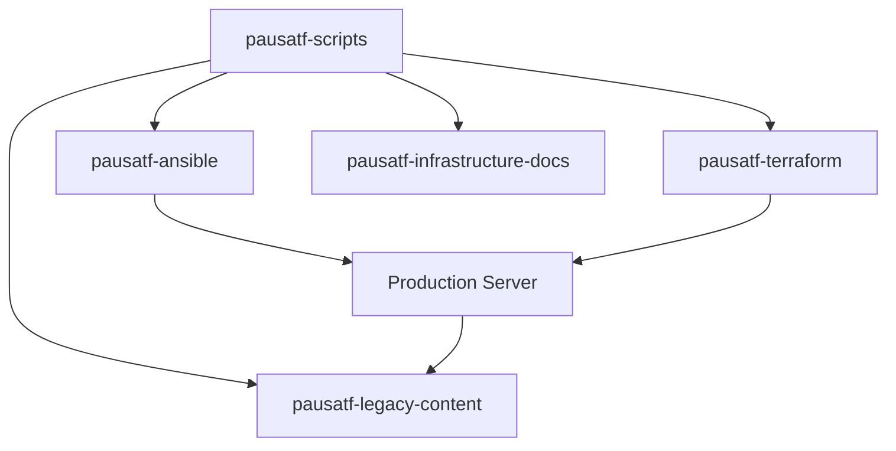

# PAUSATF Scripts Inventory

Complete inventory of all scripts in the pausatf-scripts repository.

**Last Updated**: 2025-12-21

---

## Overview

This document provides a comprehensive inventory of all operational scripts, their purpose, dependencies, and usage instructions.

## Script Categories

- [Infrastructure Management](#infrastructure-management)
- [Legacy Content Sync](#legacy-content-sync)
- [Configuration Files](#configuration-files)

---

## Infrastructure Management

### terraform-wrapper.sh

**Location**: `terraform-wrapper.sh`
**Type**: Bash shell script
**Purpose**: Safe execution wrapper for Terraform commands with validation and safety checks

**Features**:
- Environment validation (production/staging)
- Dependency checking (terraform, jq)
- Plan file management
- Safety delays for destructive operations
- Colored output for clarity

**Usage**:
```bash
./terraform-wrapper.sh <environment> <action>

# Examples:
./terraform-wrapper.sh production plan
./terraform-wrapper.sh staging apply
./terraform-wrapper.sh production output
```

**Actions Supported**:
- `init` - Initialize Terraform
- `validate` - Validate configuration
- `plan` - Create execution plan
- `apply` - Apply changes (5-second safety delay)
- `destroy` - Destroy infrastructure (10-second safety delay)
- `output` - Display output values

**Dependencies**:
- terraform (HashiCorp Terraform CLI)
- jq (JSON processor)

**Environment Variables**:
- `DIGITALOCEAN_ACCESS_TOKEN` (optional, warns if not set)
- `CLOUDFLARE_API_TOKEN` (optional, warns if not set)

**Error Handling**:
- Uses `set -euo pipefail` for strict error handling
- Validates all inputs before execution
- Checks for required dependencies
- Provides clear error messages

**Safety Features**:
- Enforces plan-before-apply workflow
- Countdown delays for destructive operations
- Environment name validation
- Automatic plan file cleanup

**Documentation**: See [TERRAFORM-WRAPPER.md](TERRAFORM-WRAPPER.md) for complete documentation

**Related IaC Components**:
- Used by: Manual infrastructure operations, CI/CD pipelines
- Works with: [pausatf-terraform](https://github.com/pausatf/pausatf-terraform)
- Deployed via: Manual execution, documented in [pausatf-infrastructure-docs](https://github.com/pausatf/pausatf-infrastructure-docs)

**Maintenance Notes**:
- Last modified: 2025-12-21
- Maintained by: Thomas Vincent
- Status: Active, production-ready

---

## Legacy Content Sync

### sync-legacy-content-watcher.sh

**Location**: `legacy-content/sync-legacy-content-watcher.sh`
**Type**: Bash shell script
**Purpose**: Real-time file watcher for syncing legacy static content to GitHub

**Features**:
- Uses inotify for real-time file system monitoring
- 30-second debounce to prevent excessive commits
- Automatic exclusion of metadata files
- Comprehensive error handling and logging
- Runs as systemd service

**Usage**:
```bash
# Run manually (testing)
/usr/local/bin/sync-legacy-content-watcher.sh

# Run as systemd service (production)
systemctl start sync-legacy-content-watcher
systemctl status sync-legacy-content-watcher
```

**Configuration**:
```bash
LEGACY_DIR="/var/www/legacy/public_html"  # Source directory
GIT_REPO_PATH="/opt/pausatf-legacy-content" # Git repository path
DEBOUNCE_SECONDS=30                         # Wait time after changes
```

**Monitored Events**:
- File creation
- File modification
- File deletion
- File moves/renames

**Excluded Files** (automatically):
- `.DS_Store` (macOS metadata)
- `._*` (macOS resource forks)
- `.mirrorinfo*` (FTP sync metadata)
- `.ftpquota` (FTP quota files)
- `.wysiwygPro_*` (Editor temporary files)
- `Thumbs.db` (Windows metadata)
- `*.swp` (Vim swap files)
- `*.tmp` (Temporary files)

**Dependencies**:
- inotify-tools (`inotifywait`)
- git
- rsync

**Logging**:
- Log file: `/var/log/legacy-content-sync.log`
- Systemd journal: `journalctl -u sync-legacy-content-watcher`

**Error Handling**:
- Continues monitoring on sync failures
- Logs all errors
- Automatic restart on failure (systemd configuration)

**Deployment**:
- Deployed via: [pausatf-ansible](https://github.com/pausatf/pausatf-ansible) playbook `deploy-legacy-content-sync.yml`
- Systemd service: `sync-legacy-content-watcher.service`

**Documentation**: See [legacy-content/README.md](legacy-content/README.md) and [legacy-content/SYNC-SETUP.md](legacy-content/SYNC-SETUP.md)

**Related Repositories**:
- Target repository: [pausatf-legacy-content](https://github.com/pausatf/pausatf-legacy-content)
- Deployment: [pausatf-ansible](https://github.com/pausatf/pausatf-ansible)

**Maintenance Notes**:
- Last modified: 2025-12-21
- Maintained by: Thomas Vincent
- Status: Active, deployed on production server
- Server: pausatf-prod (64.225.40.54)

---

### sync-legacy-content-cron.sh

**Location**: `legacy-content/sync-legacy-content-cron.sh`
**Type**: Bash shell script
**Purpose**: Scheduled sync of legacy content to GitHub (cron job alternative/backup)

**Features**:
- Lock file prevents concurrent runs
- Comprehensive change detection and reporting
- Safe for frequent execution (checks for changes before committing)
- Full logging of all operations
- Can run alongside watcher as backup

**Usage**:
```bash
# Run manually
/usr/local/bin/sync-legacy-content-cron.sh

# Run via cron (recommended: every 6 hours)
0 */6 * * * /usr/local/bin/sync-legacy-content-cron.sh >> /var/log/legacy-content-sync-cron.log 2>&1
```

**Configuration**:
```bash
LEGACY_DIR="/var/www/legacy/public_html"  # Source directory
GIT_REPO_PATH="/opt/pausatf-legacy-content" # Git repository path
LOCK_FILE="/var/run/legacy-content-sync.lock" # Prevents concurrent runs
```

**Workflow**:
1. Check for lock file (prevent concurrent runs)
2. Pull latest changes from GitHub
3. Rsync files from legacy directory
4. Check for changes
5. Commit changes with detailed message
6. Push to GitHub
7. Remove lock file

**Dependencies**:
- git
- rsync
- Standard Unix tools (awk, grep, etc.)

**Logging**:
- Log file: `/var/log/legacy-content-sync-cron.log`
- Includes change counts in commit messages
- Timestamps all operations

**Error Handling**:
- Lock file prevents overlapping runs
- Cleans up lock file on exit
- Continues on non-fatal errors
- Detailed error logging

**Deployment**:
- Deployed via: [pausatf-ansible](https://github.com/pausatf/pausatf-ansible) playbook `deploy-legacy-content-sync.yml`
- Cron job configured automatically by Ansible

**Recommended Schedule**:
```bash
# Every 6 hours (default)
0 */6 * * * /usr/local/bin/sync-legacy-content-cron.sh >> /var/log/legacy-content-sync-cron.log 2>&1

# Daily at 2 AM (light usage)
0 2 * * * /usr/local/bin/sync-legacy-content-cron.sh >> /var/log/legacy-content-sync-cron.log 2>&1

# Every hour (heavy usage)
0 * * * * /usr/local/bin/sync-legacy-content-cron.sh >> /var/log/legacy-content-sync-cron.log 2>&1
```

**Documentation**: See [legacy-content/README.md](legacy-content/README.md) and [legacy-content/SYNC-SETUP.md](legacy-content/SYNC-SETUP.md)

**Related Repositories**:
- Target repository: [pausatf-legacy-content](https://github.com/pausatf/pausatf-legacy-content)
- Deployment: [pausatf-ansible](https://github.com/pausatf/pausatf-ansible)

**Maintenance Notes**:
- Last modified: 2025-12-21
- Maintained by: Thomas Vincent
- Status: Active, deployed on production server
- Server: pausatf-prod (64.225.40.54)

---

## Configuration Files

### sync-legacy-content-watcher.service

**Location**: `legacy-content/sync-legacy-content-watcher.service`
**Type**: Systemd service unit file
**Purpose**: Systemd service configuration for legacy content watcher

**Features**:
- Automatic restart on failure
- Security hardening (PrivateTmp, NoNewPrivileges)
- Centralized logging via systemd journal
- Starts after network is available

**Installation**:
```bash
# Copy to systemd directory
sudo cp sync-legacy-content-watcher.service /etc/systemd/system/

# Reload systemd
sudo systemctl daemon-reload

# Enable and start
sudo systemctl enable sync-legacy-content-watcher
sudo systemctl start sync-legacy-content-watcher
```

**Service Configuration**:
```ini
[Unit]
Description=PAUSATF Legacy Content Git Sync Watcher
After=network.target

[Service]
Type=simple
User=root
ExecStart=/usr/local/bin/sync-legacy-content-watcher.sh
Restart=always
RestartSec=10
StandardOutput=append:/var/log/legacy-content-sync.log
StandardError=append:/var/log/legacy-content-sync.log

[Install]
WantedBy=multi-user.target
```

**Management Commands**:
```bash
# Check status
systemctl status sync-legacy-content-watcher

# View logs
journalctl -u sync-legacy-content-watcher -f

# Restart service
systemctl restart sync-legacy-content-watcher

# Stop service
systemctl stop sync-legacy-content-watcher

# Disable service
systemctl disable sync-legacy-content-watcher
```

**Deployment**:
- Deployed via: [pausatf-ansible](https://github.com/pausatf/pausatf-ansible) playbook `deploy-legacy-content-sync.yml`

**Documentation**: See [legacy-content/SYNC-SETUP.md](legacy-content/SYNC-SETUP.md)

**Maintenance Notes**:
- Last modified: 2025-12-21
- Maintained by: Thomas Vincent
- Status: Active, running on production server
- Server: pausatf-prod (64.225.40.54)

---

## Script Statistics

### By Type

| Type | Count | Percentage |
|------|-------|------------|
| Bash Scripts | 3 | 75% |
| Systemd Service Files | 1 | 25% |
| **Total** | **4** | **100%** |

### By Category

| Category | Scripts | Status |
|----------|---------|--------|
| Infrastructure Management | terraform-wrapper.sh | Active |
| Legacy Content Sync | sync-legacy-content-watcher.sh, sync-legacy-content-cron.sh | Active |
| System Services | sync-legacy-content-watcher.service | Active |

### By Deployment Status

| Status | Count | Scripts |
|--------|-------|---------|
| Production Deployed | 3 | sync-legacy-content-watcher.sh, sync-legacy-content-cron.sh, sync-legacy-content-watcher.service |
| Local/Manual Use | 1 | terraform-wrapper.sh |

---

## Dependencies Summary

### Required Tools

| Tool | Scripts Using | Purpose |
|------|---------------|---------|
| bash | All shell scripts | Script execution |
| git | sync-legacy-content-*.sh | Version control operations |
| rsync | sync-legacy-content-*.sh | File synchronization |
| inotify-tools | sync-legacy-content-watcher.sh | File system monitoring |
| terraform | terraform-wrapper.sh | Infrastructure as code |
| jq | terraform-wrapper.sh | JSON processing |

### Environment Variables

| Variable | Scripts Using | Required? |
|----------|---------------|-----------|
| DIGITALOCEAN_ACCESS_TOKEN | terraform-wrapper.sh | Optional (warns if missing) |
| CLOUDFLARE_API_TOKEN | terraform-wrapper.sh | Optional (warns if missing) |

---

## Deployment Locations

### Production Server (pausatf-prod: 64.225.40.54)

| Script | Deployed Location | Status |
|--------|------------------|--------|
| sync-legacy-content-watcher.sh | /usr/local/bin/ | Active (systemd) |
| sync-legacy-content-cron.sh | /usr/local/bin/ | Active (cron) |
| sync-legacy-content-watcher.service | /etc/systemd/system/ | Enabled |

### Local/Development

| Script | Location | Status |
|--------|----------|--------|
| terraform-wrapper.sh | Repository root | Manual use |

---

## Monitoring and Logs

### Log Files

| Script | Log Location | Rotation |
|--------|-------------|----------|
| sync-legacy-content-watcher.sh | /var/log/legacy-content-sync.log | Configured |
| sync-legacy-content-cron.sh | /var/log/legacy-content-sync-cron.log | Configured |
| terraform-wrapper.sh | stdout/stderr | N/A |

### Systemd Services

| Service | Journal Command |
|---------|----------------|
| sync-legacy-content-watcher | `journalctl -u sync-legacy-content-watcher -f` |

### Log Rotation

Configured via `/etc/logrotate.d/legacy-content-sync`:
```
/var/log/legacy-content-sync.log
/var/log/legacy-content-sync-cron.log {
    daily
    rotate 30
    compress
    delaycompress
    missingok
    notifempty
    create 0640 root root
}
```

---

## Integration with IaC Ecosystem

### Repository Dependencies



### Related Repositories

| Repository | Purpose | Relationship |
|------------|---------|--------------|
| [pausatf-ansible](https://github.com/pausatf/pausatf-ansible) | Configuration management | Deploys scripts to servers |
| [pausatf-terraform](https://github.com/pausatf/pausatf-terraform) | Infrastructure provisioning | Used by terraform-wrapper.sh |
| [pausatf-legacy-content](https://github.com/pausatf/pausatf-legacy-content) | Legacy content archive | Target of sync scripts |
| [pausatf-infrastructure-docs](https://github.com/pausatf/pausatf-infrastructure-docs) | Documentation | Documents all scripts and infrastructure |

---

## Maintenance

### Adding New Scripts

When adding a new script to this repository:

1. **Create the script** following the template in README.md
2. **Add documentation** to this SCRIPTS.md file
3. **Create detailed docs** if complex (like TERRAFORM-WRAPPER.md)
4. **Update README.md** if needed
5. **Add to Ansible** if deployed to servers
6. **Update related documentation** in pausatf-infrastructure-docs
7. **Test thoroughly** in staging before production
8. **Commit with descriptive message**

### Script Review Checklist

- [ ] Shebang line (`#!/bin/bash`)
- [ ] Error handling (`set -euo pipefail`)
- [ ] Header comments (purpose, author, date)
- [ ] Dependency checking
- [ ] Input validation
- [ ] Logging capability
- [ ] Error messages
- [ ] Documentation added to SCRIPTS.md
- [ ] Tested in staging
- [ ] Pre-commit hooks pass

### Update Frequency

This inventory should be updated:
- When new scripts are added
- When scripts are modified significantly
- When deployment locations change
- When dependencies change
- Monthly review for accuracy

---

## Security Considerations

### Secrets Management

- **Never commit secrets** to this repository
- Use environment variables for API tokens
- Use `.env` files (gitignored) for local development
- Use Ansible Vault for deployed secrets
- Rotate credentials regularly

### Access Control

| Script | Permissions | Owner | Group |
|--------|-------------|-------|-------|
| sync-legacy-content-watcher.sh | 700 | root | root |
| sync-legacy-content-cron.sh | 700 | root | root |
| terraform-wrapper.sh | 755 | user | user |

### Security Features

- Pre-commit hooks prevent secret commits
- Scripts use minimal required permissions
- Systemd services include security hardening
- Lock files prevent concurrent dangerous operations
- Safety delays on destructive operations

---

## Future Plans

### Planned Script Categories

These directories exist for future scripts:

- `backup/` - Backup and restore automation
- `deployment/` - Deployment automation
- `monitoring/` - Health checks and monitoring
- `maintenance/` - Routine maintenance tasks
- `security/` - Security scans and updates
- `cloudflare/` - Cloudflare API automation
- `database/` - Database maintenance

See README.md for planned scripts in each category.

---

## Support

For questions or issues with any scripts:
- [Open an issue](https://github.com/pausatf/pausatf-infrastructure-docs/issues)
- [Start a discussion](https://github.com/pausatf/pausatf-infrastructure-docs/discussions)
- Contact: @thomasvincent

---

**Document Maintained By**: Thomas Vincent
**Organization**: Pacific Association of USA Track and Field (PAUSATF)
**Last Updated**: 2025-12-21
